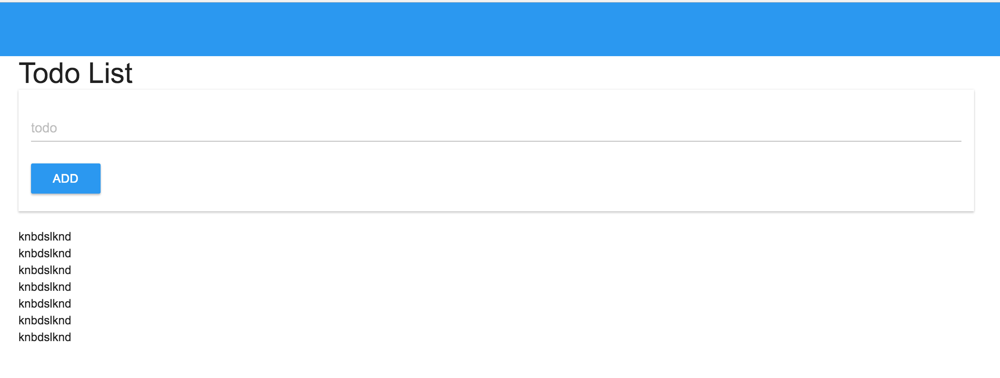

TodoList With Browser Storage

Front | Back 
----- | ----
[ES6](https://github.com/lukehoban/es6features) | [CoreNodeHttp](https://nodejs.org/dist/latest-v7.x/docs/api/http.html) 
[LocalStorage](https://developer.mozilla.org/en-US/docs/Web/API/Window/localStorage) |
[MaterialUI](http://www.material-ui.com/#/) |
